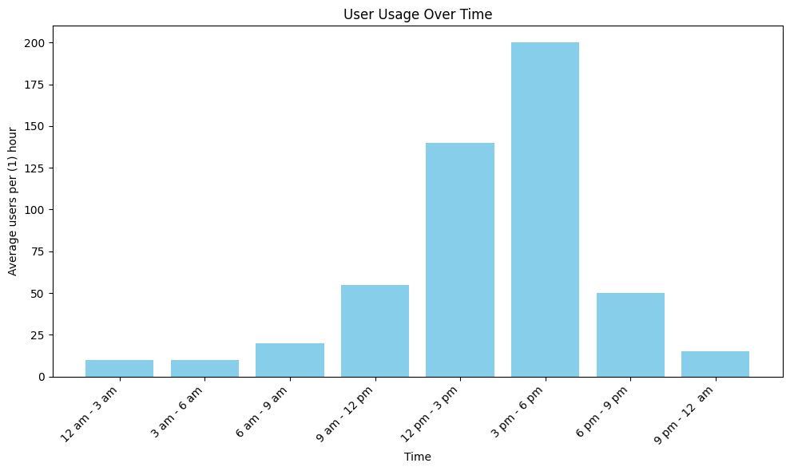
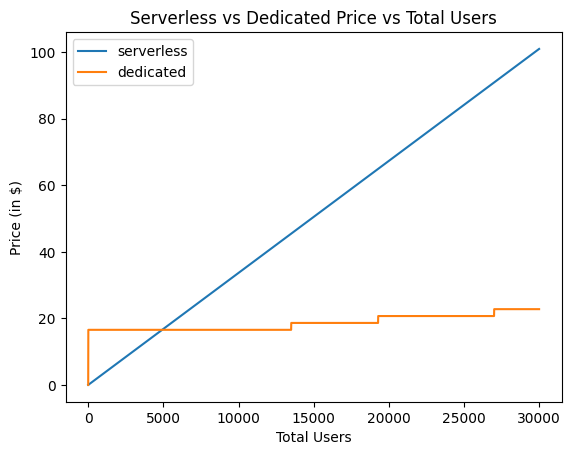

# Task 1 - Sentiment Prediciton Model
## Assumptions
* In the assignment, it says that `open-source self-hosted *LLM*`, which implies that the use of Language models specified for sentiment analysis is not allowed. Hence, I've used a conversational LLM to fit the criteria based on my understanding.

## How to run
### Installation
Thanks to docker, you can easily run this program using 2 simple commands.

1. Clone the repo: ```git clone https://github.com/AbdelRahmanYaghi/MaqsamAssignment.git```
2. Change directory to the cloned directory: ```cd MaqsamAssignment```
2. Run the docker compose file: ```docker compose up --build```

### POST - /query_sentiment
**Accepts**: 
    
    - summary (str): A string in English or Arabic containing the transription summary

**Returns**: 

    - Sentiment (str): A literal choice of "Positive", "Negative", "Neutral"

Using curl:
```bash
curl \
  'http://localhost:8000/query_sentiment' \
  -H 'accept: application/json' \
  -H 'Content-Type: application/json' \
  -d '{
  "summary": "Lorum ipsum..."
}'
```
Using python:
```py
import requests
import json

res = requests.post(
    'http://localhost:8000/query_sentiment',
     data=json.dumps(
        {"summary": "Lorum ipsum..."}
    )
)

print(res.content)
```

## Methodology
### LLM Inference tool selection
Since I'll be using an LLM, a valid and safe choice to use will be Ollama. It does limit the model selection, especially that a lot of the newer models (e.g. SmolLM3) I wanted to use originally are incompatible with the latest version of Ollama (0.11.3) which caused some issues. On the other hand, it is easy, fast, and relatively small in size.

### LLM Selection
Since I'll be using Ollama for my model deployment, it does limit the models I can use. From the models I was able to run, I had GPT generate me a list of 30 different example summaries with their sentiment, and their language. These could be found in `llm_tests/call_summaries_sentiment.csv`. The testing was carried out on 2 different phases (Using 2 different scripts). The tests were carried out on a 4060 8GB GPU.

1. **Phase 1: Creating the model output results** ` python -m llm_tests.create_results`

In this phase, I simply create a simple jsons following the following format:
```json
{
    "Arabic | English": [
        {
            "summary": "STR >> The summary given to the model >> Included incase needed for human evaluation",
            "predicted_sentiment": "Positive | Negative | Neutral >> The predicted sentiment",
            "true_sentiment": "Positive | Negative | Neutral >> The true sentiment",
            "justification": "The justification for the predicted sentiment >> Included incase needed for human evaluation"
        }
    ] 
}
```

2. **Phase 2: Scoring the results** ` python -m llm_tests.score_results`

In this phase, I use multiple scoring methods on the results from the first phase. The reason behind splitting these into two phases is because using only accuracy as a metric will not be entirely accurate for such a use-case. For example, if the model predicted `Postive` and the true value was `Negative` should not be treated as equal as if the model predicted `Postive` and the true value was `Neutral`. Therefore, I wanted to test and research around differnt metrics. Here is an overview of the results generated in `llm_tests/models_scores.json` which includes all the scores in details per language and per metric.


| Model Name | Accuracy | Distance | Precision | Recall | Time per Request |
|------------|----------|----------|-----------|--------|------------------|
| qwen3:8b | **0.8** | 3.5 | **__0.8403__** | **__0.8__** | 1.44 seconds |
| deepseek-r1:8b | **__0.8__** | **__3.0__** | 0.8083 | **__0.8__** | 1.82 seconds |
| gemma3:4b | 0.6667 | 6.0 | 0.6796 | 0.6667 | **__1.12 seconds__** |
| hf.cotensorblockPhi-4-mini-instruct-abliterated-GGUF:Q8_0 | 0.6333 | 5.5 | 0.5079 | 0.6333 | 1.26 seconds |

I ended up using ***qwen3:8b*** since it had the perfect balance between an acceptable score (in both English and Arabic) and good time/request.

### Endpoints setup
For creating the endpoints, I've used Fastapi. Its reliable, fast, and offers the swagger gui which makes it slightly easier to test my endpoints. For running the endpoint, I used uvicorn ASGI since its slighlt less heavy than installing fastapi[cli].


# Task 2 - Prod Design Document
## LLM Inference
While I can just deploy my docker compose on an EC2 instance and call it a day, many points to consider will be missed, leading to ineffcient use of the tools available. For example, if we use [RunPod.io](https://www.runpod.io/), we could deploy our LLM model more effectivly thanks to their [cost-optimized AI model serving](https://www.runpod.io/use-cases/inference). This allows our LLM to be both cost-effcient, while having the scaling required to serve any number of users. We could even go for a serverless inference which avoids idle GPU costs. (I apologize if this sounds like an advertisment for runpod, it's just a good service.)


## Endpoint
For the endpoint, an easy and safe choice would be using a serverless function cloud provider, such as AWS lambda or Google's Cloud Run functions. The reason behind choosing a serverless function cloud provider rather than a serverful is that it is generally cheaper, and should work perfectly for our usecase, which in this case would literally only be a fastapi endpoint that requests from another endpoint (The LLM over at Runpod). And despite serverless functions usually having a problem with cold starts, AWS lambda and Cloud Run functions are optimized to reduce this issue significantly.

## Cost Estimation
For the cost estimation, I'll have to assume the 1500 users are using the service per day spanning across this distrubtion on this table (distrubution):

| Time Slot         | Users per Hour | Users per minute
|-------------------|:--------------:|:----------------:
| 12 am - 3 am      |      10        |        0.16
| 3 am - 6 am       |      10        |        0.16
| 6 am - 9 am       |      20        |        0.33
| 9 am - 12 pm      |      55        |        0.91
| 12 pm - 3 pm      |     140        |        2.33
| 3 pm - 6 pm       |     200        |        3.33
| 6 pm - 9 pm       |      50        |        0.83
| 9 pm - 12 am      |      15        |        0.25



For the **LLM inference**, we will conduct tests to test whether a dedicated server will be more efficient vs a serverless host. We will start with calculating the serverless option: 

    Lets assume that we are using a serverless 4090 from RunPod. A 4090 server would cost $1.10/hr. We also have to assume that the average request takes a maximum 7 seconds (In reality it will only take around 5). Another important assumption is whether flex (workers that are active during spikes in usage) or active (workers that are always on) workers will be used. We will assume that active workers are on during the entire day, except at between 12 pm and 6 pm where both active and flex workers will be active.

    - Each user causes the model to be used for 7 seconds
    - $0.00031/s for model usage - flex
    - $0.00021/s for model usage - active

    - $A$ = Users per Hour during Normal hour periods
    - $B$ = Users per Hour during Rush hour periods

$$cost_{serverless} = \sum_{a \in A}{(3* 0.00021 * 7)a} + \sum_{b \in B}{(3* (0.00021 + 0.00031) * 7)b} $$

    The cost comes to $5.04/day for a serverless option.

    Now we will calculate the dedicated server cost. To be able to do that, we have to assume how many calls happen per hour so that we can calculate how many calls intercept each other which will be required to calculated the number of models served. We will still assume that 1500 users use the service per day. 
    
    The users per minute is required because we will assume that that is the number of models served required per hour. 
    We can now estimate the cost of the dedicated RunPod 4090 (24 GB Vram).

    - $0.69/hr for dedicated server.
    - Each request takes around 8 seconds.
    - A single 4090 can serve 4 qwen3:8b (5GB) models at once.
        - 3600 seconds  * 4 models / 8 seconds per request = 1800 users/hour per 1 gpu
        - 30 users/minute per 1 gpu
    - $U$: Users per minute thoughout its respective time windows.
    
    Cost:

$$cost_{dedicated}(i) = \sum_{i \in U}3*0.69*ceil(i/30)$$

    Meaning that 1500 users a day (given the ditribution above) will cost: $16.56/day on a dedicated server

    Despite it seeming like the serverless is cheaper, it scales much faster than dedicated. The graph below shows so:



    After reaching around 4922 users, the dedicated starts being more feasible than the serverless. Ofcourse all of the above is assuming we are still following the distribution of the users above.


    Also, I am assuming that we want to process each request live, and cannot just store them in memory and crone-job them all at once. If that were the case, then life would be much easier to calculate. And dedicated would be more fitting for that case. 

For the **AWS lambda function**, its cost can be calculated using [their website](https://calculator.aws/#/createCalculator/Lambda). Given these assumptions:
- Region: Frankfurt
- 45,000 requests per month (1500 users * 30 days)
- 8000 ms Request time
- 2048 Memory

The cost will come to 12.02$/month

## Load and Evolving

Regarding the varying loads, the tools I have mentioned all support automatic scaling based on usage. And regarding evolving the model, it can easily be evolved by adding more AWS lambda function querying the LLM for different use cases.

# Task 3: Summarization model
## Data selection
We have 3 approaches of obtaining the data. They can either be very expensive, but also very high quality, or vice versa.

1. **Human Generated Data - Most Expensive**: This approach produces the most clean and highest quality data, however, it does come at a cost, and at a great one at that. Unfortunatly, or fortunatly, I never had to use this approach, hence I can't elaborate any further, like providing an expected price for this. However, a good approach is a hybrid approach between this approach and the next one, which I will go over in the next point.

2. **LLM Generated Data - Mid Quality/Price**:
    This approach is what I usually go for. It depends on a lot of factors such as the system prompt, the model used, the tools provided to the model, helper functions that wrap the generation, etc.. It produces satisfactory data, with a risk of duplicated or very similar data points. Regarding its cost, assuming we are using an OpenAI model rather than a local model, such as gpt 4o-mini, it would cost around:
    $$Datapoint = (2048 * (0.15/1,000,000)) + ((256 + 64) * (0.6/1,000,000)) $$ 
    Assuming:

    - 2048 is the size of the system prompt
    - 256 is the input transcription (Deducted from the examples provided in the assignment)
    - 64 is the output summary (Deducted from the examples provided in the assignment)

    Meaning each data point costs 0.0004992$. So if we ended up training an 8B model, we might need anywhere between 1000-10000 datapoints depending on their quality, which would cost between ~0.5-5 dollars.

    Despite 1000 datapoints seeming not much, it has been agreed upon that high quality with low datapoints is generally better than low quality with high datapoints. Here is the paper "[60 Data Points are Sufficient to Fine-Tune LLMs for Question-Answering](https://arxiv.org/abs/2409.15825)" which is self explainatory from the title. I am aware that Question answering is generally less complex than summarization, but point still stands. And in the [Meta llama finetuning docs](https://llama.developer.meta.com/docs/features/fine-tuning), it literally says that "Your fine-tuning dataset should have at least 10 examples, but you will likely get better results with at least several hundred examples."

    I suggested in the previous point that having a hybrid solution between the two approaches would work best, and that is generating a few hundred datapoints, and then having a human / set of humans validate the datapoint and ensure that they are high quality.

3. **Huggingface**: Huggingface contains a large amount of datasets ready to be used for finetuning for free. However, the problem with this approach is that the data rarely is specific for your usecase.

Whichever method we end up using, it would be a good idea to generate/obtain more datapoints which will be used in evaluating a metric. A good ratio between training, testing, and evaluating data is 7:2:1 respectively. 

### Data schema/format
I suggest following something similar to this format:
```json
{
    "transcription_id": "str",
    "transcription_text": "str",
    "Lanuage": "Literal[English, Arabic]",
    "Dialect": "Literal[Levant, Gulf, Egypt, Darija]",
    "transcription_summary": "str"
}
```
Despite the language and the dialect not being used for training, they can be used to give valuable post training insight about the model's performance, or lack of, in certain dialects.

## Model training
For choosing a model, I would test a set of LLMs on a summarization task by configuring them to summarization via a system prompt. That would help me get a better understanding of what models naturally exceed at the summarization task. I will evaluate the models using the evaulation methods I will propose the next section. Some good candidates in mind are:
-  qwen3:8b
-  llama3.1:8b
-  smollm3:8b

I am considering these models because I am assuming that I am not provided with expensive infrastructure. However, if I were provided with the neccesary funding for training the model then I would, funnily enough, go back to RunPod since it does provide infrastrucre for fine-tuning. And it is quite simple, all you need is an SSH connection and around 50$, which allows the renting of a 5090 (32Gb VRAM) or a L40 (48Gb VRAM) for around 60 hours. That should be enough for training a slightly larger model (The ones metioned previously but with larger size or) such as the new OpenAI Open source LLM, GPT-OSS, which is around 18 GBs. The reason behind choosing GPT-OSS as the slightly larger model to train is because it offers great reasoning capabilities based on personally testing it recently.  In addition to that, all GPT models can handle different Arabic accents. This model might obiously not have this ability, which is worth testing for.

If I trained a larger model, then I would probably use Low rank adaptation because I do not want to influence the model's reasoning capablities too much by effecting all the layers in the model, and so I want to ensure the model's stability, it is the safer option that could provide better results overall rather than training the entire model. Another approach I could give a shot is training an seperate adapter which could then be used along the side.

I am not worried so much about the Arabic and English language aspect since all the models I have mentioned are multilingual, and naturally capable of understanding both English and Arabic. 

## Metrics

All the methods here will be using the "evaluating data" mentioned in the data generation part as the true output.

### Intersection of tokens (ROUGE-X)
A method for evaluating a summarization model is creating a set containing all the tokens in the true output text, and another set containing all the tokens in the generated summarized text. Then, intersecting these two sets and checking the number of intersected tokens. This approach is (ROUGE-1), and we can obviously expand upon that to test for (ROUGE-2, ROUGE-K).

### Humal Eval
As always, this is the most accurate method, yet it's unfeasible because of its cost, and because of the subjectivity of the different humans.

### Semantic Textual Similarity
Using a sentence feature extractor model on the true output and the summarized text, and comparing the distance between the resulting embeddings. Or we can go with BERTScore which is slightly more general, and has more metrics.

### Difference between summarized text sentiment and true output sentiment
This approach is a little sketchy, and one has to assume no stochastic-ness from the sentiment prediction model, and the prediction model having perfect accuracy. This of course is unrealistic, however, this approach might provide to be useful for our specific use case.

### Reverse the summarized text (Does not use true output)
Using an LLM to generate a transcription based on the summary given, and then using one of the methods above, i.e., either embedding both transcriptions (The original one and the generated one) and finding the distance between the embedding, using ROUGE-K, or finding the difference between the two sentiments. 

### Privacy Metrics
I've noticed in the examples provided that the company/individual names are ommited from the output. I simple way we can test for the privacy is by using a Named Entity Recognition model to extract the company/individual from the original text and checking their existance in the summarized text.

### Baseline
All the results prior will be compared against a baseline of the testing done all the way in part 1 of the assingnment, where we tested the candidate model on summaring the text using a system prompt wihtout fine tuning. 