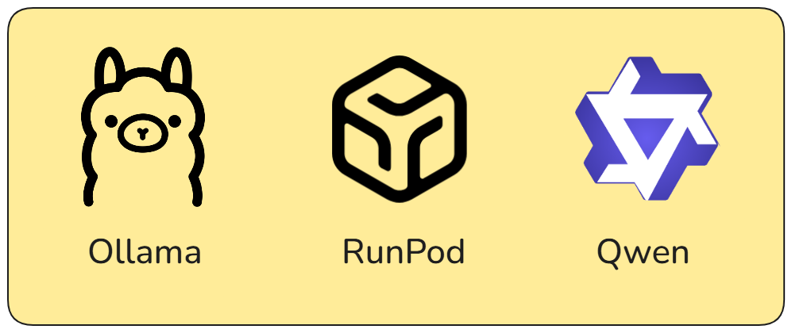

# Task 1 - Sentiment Prediciton Model
## Assumptions
* In the assignment, it says that `open-source self-hosted *LLM*`, which implies that the use of Language models specified for sentiment analysis is not allowed. Hence, I've used a conversational LLM to fit the criteria based on my understanding.

## How to run
### Installation
Thanks to docker, you can easily run this program using 2 simple commands.

1. Clone the repo: ```git clone https://github.com/AbdelRahmanYaghi/MaqsamAssignment.git```
2. Change directory to the cloned directory: ```cd MaqsamAssignment```
2. Run the docker compose file: ```docker compose up --build```

### POST - /query_sentiment
**Accepts**: 
    
    - summary (str): A string in English or Arabic containing the transription summary

**Returns**: 

    - Sentiment (str): A literal choice of "Positive", "Negative", "Neutral"

Using curl:
```bash
curl \
  'http://localhost:8000/query_sentiment' \
  -H 'accept: application/json' \
  -H 'Content-Type: application/json' \
  -d '{
  "summary": "Lorum ipsum..."
}'
```
Using python:
```py
import requests
import json

res = requests.post(
    'http://localhost:8000/query_sentiment',
     data=json.dumps(
        {"summary": "Lorum ipsum..."}
    )
)

print(res.content)
```

## Methodology
### LLM Inference tool selection
Since I'll be using an LLM, a valid and safe choice to use will be Ollama. It does limit the model selection, especially that a lot of the newer models (e.g. SmolLM3) I wanted to use originally are incompatible with the latest version of Ollama (0.11.3) which caused some issues. On the other hand, it is easy, fast, and relatively small in size.

### LLM Selection
Since I'll be using Ollama for my model deployment, it does limit the models I can use. From the models I was able to run, I had GPT generate me a list of 30 different example summaries with their sentiment, and their language. These could be found in `llm_tests/call_summaries_sentiment.csv`. The testing was carried out on 2 different phases (Using 2 different scripts). The tests were carried out on a 4060 8GB GPU.

1. **Phase 1: Creating the model output results** ` python -m llm_tests.create_results`

In this phase, I simply create a simple jsons following the following format:
```json
{
    "Arabic | English": [
        {
            "summary": "STR >> The summary given to the model >> Included incase needed for human evaluation",
            "predicted_sentiment": "Positive | Negative | Neutral >> The predicted sentiment",
            "true_sentiment": "Positive | Negative | Neutral >> The true sentiment",
            "justification": "The justification for the predicted sentiment >> Included incase needed for human evaluation"
        }
    ] 
}
```

2. **Phase 2: Scoring the results** ` python -m llm_tests.score_results`

In this phase, I use multiple scoring methods on the results from the first phase. The reason behind splitting these into two phases is because using only accuracy as a metric will not be entirely accurate for such a use-case. For example, if the model predicted `Postive` and the true value was `Negative` should not be treated as equal as if the model predicted `Postive` and the true value was `Neutral`. Therefore, I wanted to test and research around differnt metrics. Here is an overview of the results generated in `llm_tests/models_scores.json` which includes all the scores in details per language and per metric.


| Model Name | Accuracy | Distance | Precision | Recall | Time per Request |
|------------|----------|----------|-----------|--------|------------------|
| qwen3:8b | **0.8** | 3.5 | **__0.8403__** | **__0.8__** | 1.44 seconds |
| deepseek-r1:8b | **__0.8__** | **__3.0__** | 0.8083 | **__0.8__** | 1.82 seconds |
| gemma3:4b | 0.6667 | 6.0 | 0.6796 | 0.6667 | **__1.12 seconds__** |
| hf.cotensorblockPhi-4-mini-instruct-abliterated-GGUF:Q8_0 | 0.6333 | 5.5 | 0.5079 | 0.6333 | 1.26 seconds |

I ended up using ***qwen3:8b*** since it had the perfect balance between an acceptable score (in both English and Arabic) and good time/request.

### Endpoints setup
For creating the endpoints, I've used Fastapi. Its reliable, fast, and offers the swagger gui which makes it slightly easier to test my endpoints. For running the endpoint, I used uvicorn ASGI since its slighlt less heavy than installing fastapi[cli].


# Task 2 - Prod Design Document
## LLM Inference
While I can just deploy my docker compose on an EC2 instance and call it a day, many points to consider will be missed, leading to ineffcient use of the tools available. For example, if we use [RunPod.io](https://www.runpod.io/), we could deploy our LLM model more effectivly thanks to their [cost-optimized AI model serving](https://www.runpod.io/use-cases/inference). This allows our LLM to be both cost-effcient, while having the scaling required to serve any number of users. We could even go for a serverless inference which avoids idle GPU costs. (I apologize if this sounds like an advertisment for runpod, it's just a good service.)




## Endpoint
For the endpoint, an easy and safe choice would be using a serverless function cloud provider, such as AWS lambda or Google's Cloud Run functions. The reason behind choosing a serverless function cloud provider rather than a serverful is that it is generally cheaper, and should work perfectly for our usecase, which in this case would literally only be a fastapi endpoint that requests from another endpoint (The LLM over at Runpod). And despite serverless functions usually having a problem with cold starts, AWS lambda and Cloud Run functions are optimized to reduce this issue significantly.

## Cost Estimation
For the cost estimation, I'll have to assume the 1500 users are using the service per day.

For the **LLM inference**, we will not be using the dedicated server because it is less effecient for inference, so instead we will go for the serverless option, which is cheaper, and more effecient: 

    Lets assume that we are using a serverless 4090 from RunPod. A 4090 server would cost $1.10/hr. We also have to assume that the average request takes a maximum 8 seconds (In reality it will only take around 5). Doing very simple math with this information:

    - 1500 Users/day
    - Each user causes the model to be used for 8 seconds
    - $0.00031/s for model usage

    1500 * 8 = 12,000 seconds of model usage
    12,000 * 0.00031 = 3.72$/day OR 111.6$/month

All the calculations above were calculated using the "Flex" workers, which are the more expensive workers that are used at times of spikes in usage.

For the **AWS lambda function**, its cost can be calculated using [their website](https://calculator.aws/#/createCalculator/Lambda). Given these assumptions:
- Region: Frankfurt
- 45,000 requests per month (1500 * 30)
- 8000 ms Request time
- 2048 Memory

The cost will come to 12.02$/month

## Load and Evolving

And thanks to it being serverless, even if usage were to spike at any point, the only worry we could have is haivng a cold start from having RunPod initliaze a new GPU. In addition to that, even adding new features should only consist of creating new serverless function (on AWS or GCP for example) that use LLM deployed on RunPod.


